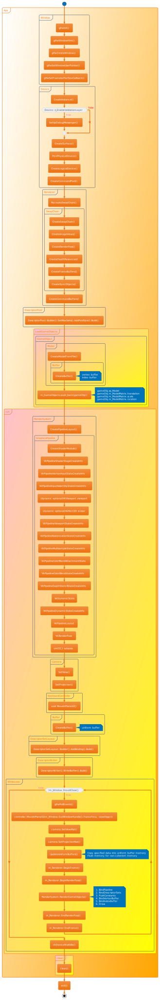
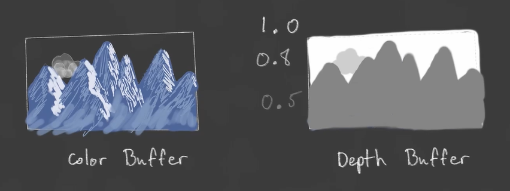

# BasicVulkanWarper
A simple basic Vulkan Warper learned from [Brendan Galea](https://github.com/blurrypiano). However I made some small changes in the implementations since it's basically for Tutorial, and I'm still working on it!🤪

## Table of Contents
*[Prerequired Tools](#prerequired-tools)

*[Build&Run](#buildrun)

*[BriefIntro](#brief-intro)


## Prerequired Tools
+ C/C++ Compiler
+ [CMake](https://cmake.org)
+ [Vulkan SDK](https://vulkan.lunarg.com/sdk/home)

## Build&Run
### Download this repository
Start by cloning this repository. Open a terminal in your working directory and type in the following commands.
```bash
    git clone --recursive https://github.com/BravoMando/BasicVulkanWarper.git
```
If the repository was cloned non-recursively, use the following commands to clone the necessary submodules.
```bash
    git submodule update --init
```
### Configure the dependencies

+ Windows
    + Run the [Build.bat](./Build.bat). It should automatically build the project with CMake based on your C/C++ compiler.
+ Ubuntu
    + Enter the [project root directory](./), open a terminal and type in the following commands to add permission.
    ```bash
        sudo chmod +x Build.sh
    ```
    + Then run the [Build.sh](./Build.sh), it should automatically build the project with CMake. If it says some dependencies you didn't installed, then install the dependencies and rerun the [Build.sh](./Build.sh).

## Brief Intro
I made a [Diagram Repository](https://github.com/BravoMando/BasicVulkanWarperUML) corresponding to this repository, it's more detail about the implementation, and hope it can help make a better understanding of Vulkan.


## Blending
Blending in Vulkan does NOT like image layer in PhotoShop, the depth buffer tracks the depth value for **each pixel** that only on the top of the fragment, any fragments behind the top will be discarded! Like the cloud bellow:

If we draw the smi-transparent object befroe the opaque object behind it, the depth value will store the smi-transparent object since it's more closer to camer(depth value is smaller), therefore the opaque object behind the smi-transparent will be discarded, which will lead to some crazy output.

Not only the initial rendering matters, but also does the following rendering matter. For example, we render the objects in the right order at the first place it turns out like this:

However when we move the camera in the oppsite position and direction to look, it turns out like this:

So we do need to take care of the render order, we need to caculate the distance between object and camera, and render from big to small(from back to front) for each frame.